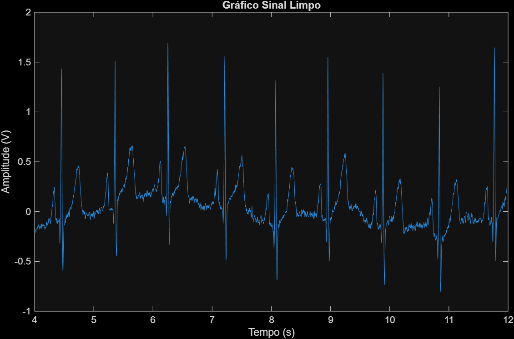
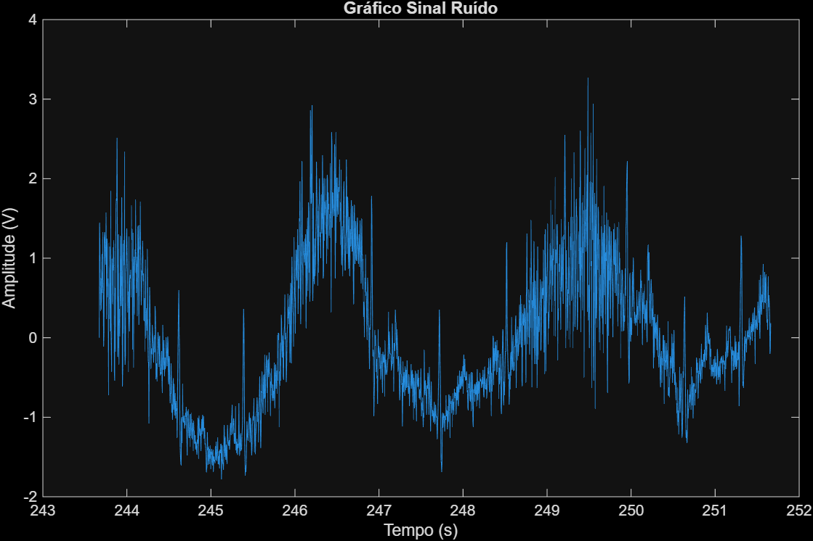
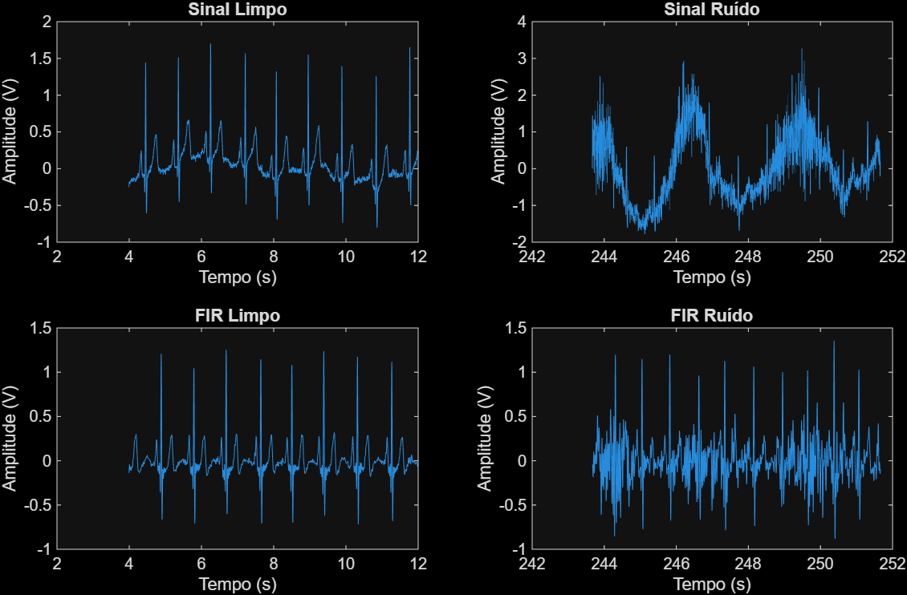
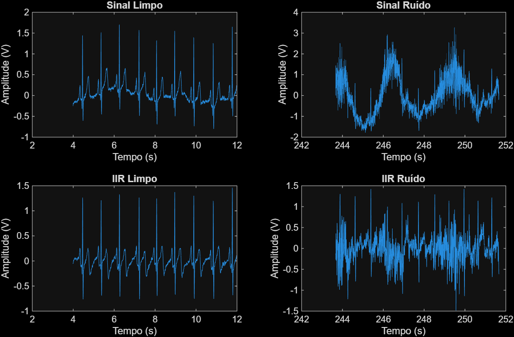

# 📊 Análise Espectral e Filtragem de Eletrocardiograma (ECG)

Projeto desenvolvido como parte da disciplina de Bioengenharia no curso de Engenharia Eletrônica pela UTFPR - CP.

## 👨‍💻 Autores

- Eduardo Barcelos Freitas  
- M. F. S. Ventura  

---

## 🧠 Objetivo

O objetivo deste projeto é analisar uma amostra real de sinal de ECG (eletrocardiograma) em dois trechos:
- Trecho Limpo: esperado em uma coleta dentro dos conformes
- Trecho Ruidoso: gerado por interferências externas (como movimento do corpo ou dos eletrodos)
  
Após isso, é aplicado e comparado técnicas de filtragem digital utilizando filtros FIR e IIR, avaliando o comportamento espectral e temporal dos sinais antes e depois da filtragem.

---

## 📁 Estrutura do Código

O script MATLAB executa as seguintes etapas:

1. **Carregamento do Sinal**  
   Leitura do arquivo `normal.txt` com o sinal de ECG.

2. **Análise do Sinal Original**  
   Visualização de trechos limpo e com ruído.

3. **Transformada de Fourier (FFT)**  
   Análise espectral dos trechos com e sem ruído.

4. **Densidade Espectral de Potência (PSD)**  
   Comparação das características frequenciais dos sinais.

5. **Filtragem FIR**  
   Aplicação de um filtro passa-banda do tipo FIR (Kaiser).

6. **Filtragem IIR**  
   Aplicação de um filtro passa-banda do tipo IIR (Butterworth).

7. **Comparações Visuais**  
   Comparação do sinal antes e depois da filtragem, tanto no domínio do tempo quanto da frequência.

---

## 📈 Resultados

### Exemplo de trechos limpo e ruidoso
<p align="center">
  
  
</p>


### Comparação dos Espectros de Sinais:


> 🔎 *Valores normalizados.*

Maior parte da informação do sinal original se encontra abaixo dos 40 Hz. O ruído gerado inseriu componentes de alta frequência comprometendo a informação do sinal original.

### Filtragem FIR

#### Comparativo no Domínio do Tempo



#### Comparativo Espectro de potência


> 🔎 *Imagens ilustrativas — substitua pelos seus gráficos reais e ajuste os caminhos.*


### Filtragem IIR

#### Comparativo no Domínio do Tempo



#### Comparativo Espectro de potência


> 🔎 *Imagens ilustrativas — substitua pelos seus gráficos reais e ajuste os caminhos.*

---

## 🔁 Funções Implementadas

### `positiveFFT(x, Fs)`
Função auxiliar para obter o espectro de frequência positivo normalizado de um sinal.

```matlab
function [X,freq]=positiveFFT(x,Fs)
    N = length(x);
    k = 0:N-1;
    T = N/Fs;
    freq = k/T;
    X = fft(x)/N;
    cutOff = ceil(N/2);
    X = X(1:cutOff);
    freq = freq(1:cutOff);
end
